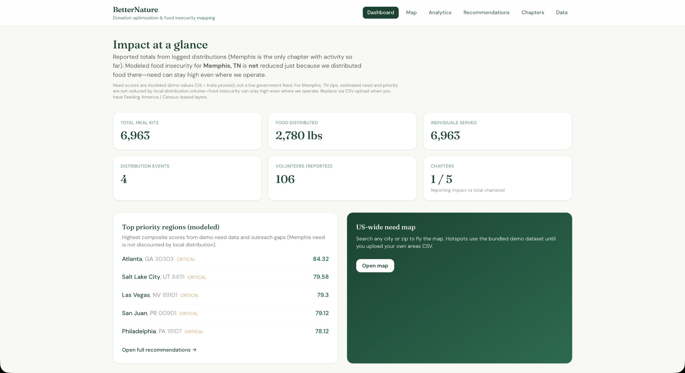
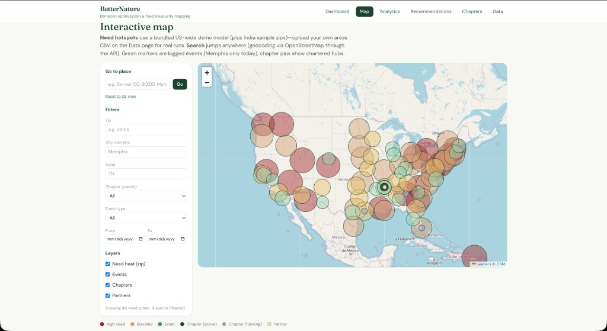
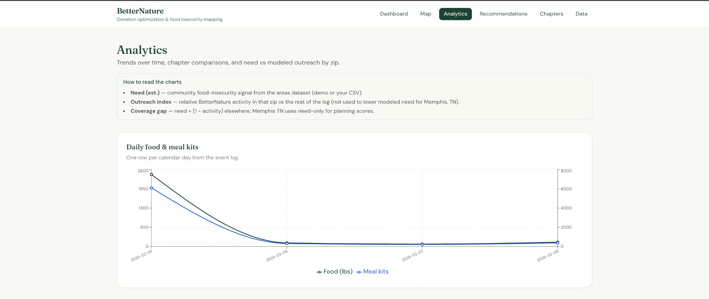
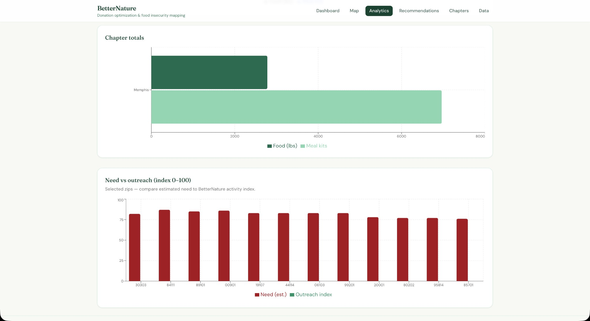
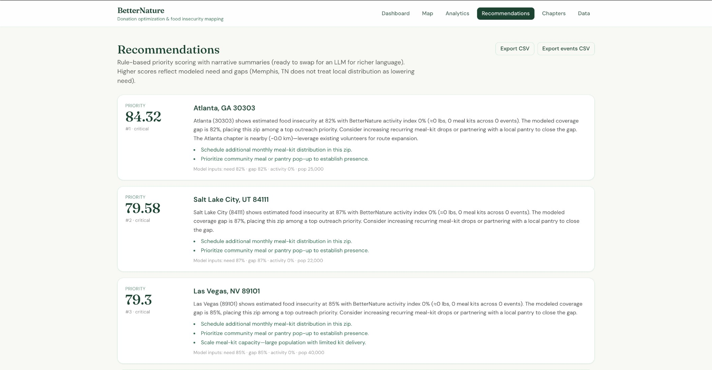
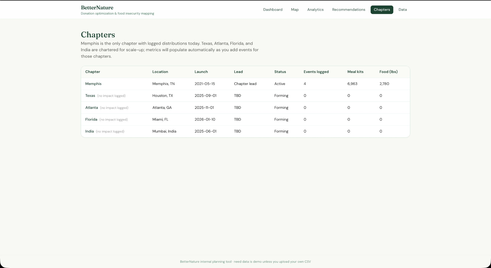
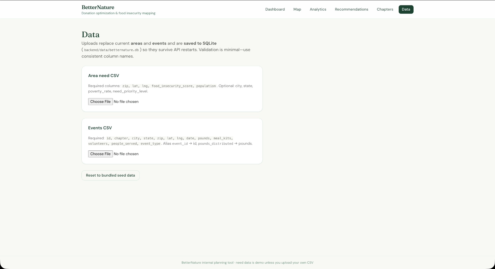

# BetterNature — Donation optimization & food insecurity mapping

Licensed under the MIT License. See `LICENSE`.

Internal-style demo: dashboard, **interactive map** (need intensity + events + chapters + partners), analytics, **rule-based priority recommendations** with narrative text, chapter table, CSV upload with **SQLite persistence**, **dataset metadata** (`/api/meta`), and **CSV exports** for recommendations and events.

## Stack

- **Frontend:** React (Vite), Tailwind CSS, React Router, Leaflet, Recharts  
- **Backend:** FastAPI, pandas  

## Screenshots

### Dashboard


### Interactive map


### Analytics — trends


### Analytics — need vs outreach


### Recommendations


### Chapters


### Data upload


## Quick start

Terminal 1 — API (from project root):

```bash
cd backend
python3 -m venv .venv
source .venv/bin/activate   # Windows: .venv\Scripts\activate
pip install -r requirements.txt
uvicorn app.main:app --reload --host 127.0.0.1 --port 8000
```

Terminal 2 — UI:

```bash
cd frontend
npm install
npm run dev
```

Open **http://localhost:5173**. The Vite dev server proxies `/api` to `http://127.0.0.1:8000`.

## Where the dashboard numbers come from

The UI calls **`GET /api/summary`** on the FastAPI app. **`DataStore`** loads **areas** and **events** from **`backend/data/betternature.db`** (SQLite); on first run it seeds from JSON in **`backend/data/`**:

| File | Role |
|------|------|
| `seed_events.json` | Each event’s pounds, meal kits, volunteers, people served → **totals** on the dashboard |
| `seed_chapters.json` | Chapter count and metadata |
| `seed_areas.json` | Modeled **US-wide** (plus sample India) need proxies for map & recommendations — regenerate with `python3 scripts/build_seed_areas.py` |
| `scripts/build_seed_areas.py` | Rebuilds `seed_areas.json` from the curated metro list + deterministic demo scores |

Dashboard **impact totals** (meal kits, lbs, people reached) come from **`seed_events.json`** (currently Memphis-only). **Chapters**: five chartered in seeds; only **Memphis** has logged events until you add rows for Texas, Atlanta, Florida, or India.

For **Memphis, TN** zips, modeled need and priority scores **do not** go down just because BetterNature distributed food there—distribution volume is tracked separately from estimated community need.

Need scores are **not** a live Feeding America API — swap in real layers via CSV upload or your own pipeline.

## Data

Bundled seed JSON under `backend/data/`. Replace via **Data** page or POST:

- `POST /api/upload/areas` — multipart `file` (CSV)
- `POST /api/upload/events` — multipart `file` (CSV)
- `POST /api/reset` — reload seeds

Sample column expectations are described on the Data page.

### API extras

- **`GET /api/meta`** — app version, row counts, last save time, methodology notes.
- **`GET /api/export/recommendations.csv`** — enriched area rows (planning columns).
- **`GET /api/export/events.csv`** — raw event log.

## Tests

```bash
cd backend
source .venv/bin/activate
pytest
```

## Optional: LLM layer

Recommendation **copy** is generated in `backend/app/scoring.py` (`explain_priority`). You can keep the scores and swap that function for an OpenAI (or other) call using the same structured fields.

## Production build

```bash
cd frontend && npm run build
```

Serve `frontend/dist` as static files. If the API is on **another origin** (required for **GitHub Pages**), set **`VITE_API_BASE`** to that API’s URL (no trailing slash) before building — see `frontend/.env.example`. The API already allows CORS from any origin for demos.

### GitHub Pages (frontend only)

**GitHub Pages cannot run Python/FastAPI.** It only hosts the built React app. Typical setup:

1. **Deploy the API** somewhere that runs Python (e.g. [Render](https://render.com), [Railway](https://railway.app), [Fly.io](https://fly.io)): run `uvicorn app.main:app --host 0.0.0.0 --port $PORT` from `backend/` with the same `requirements.txt`.
2. **Build the frontend** with your API URL baked in:
   ```bash
   cd frontend
   echo 'VITE_API_BASE=https://your-api.example.com' > .env.production.local
   npm run build
   ```
3. **Publish `frontend/dist`** to GitHub Pages (Actions workflow, or `gh-pages` branch, or “Deploy from branch” using `/docs` + copy `dist` contents — your choice).
4. If the site URL is **`https://username.github.io/repo-name/`** (project site), set Vite’s **base** so assets load correctly:
   ```bash
   npx vite build --base=/repo-name/
   ```
   (Use your real repository name in the path.)

**Client-side routing:** Deep links like `/map` can 404 on refresh unless you add a [SPA workaround for Pages](https://github.com/rafgraph/spa-github-pages) (copy `index.html` to `404.html`) or switch the app to hash-based routes.

### Monorepo on one host (not Pages)

If you control a single server (e.g. VPS), you can serve `dist/` and **reverse-proxy** `/api` to uvicorn — then leave **`VITE_API_BASE` unset** and same-origin `/api` works.

## Frontend toolchain

The app uses **Vite 8** with **`@vitejs/plugin-react` 5.2+** (they must stay compatible). Upgrade them together if you bump versions.

## Contact

Questions, feedback, or collaboration ideas:

- **Email:** ganesh@betternatureofficial.org
